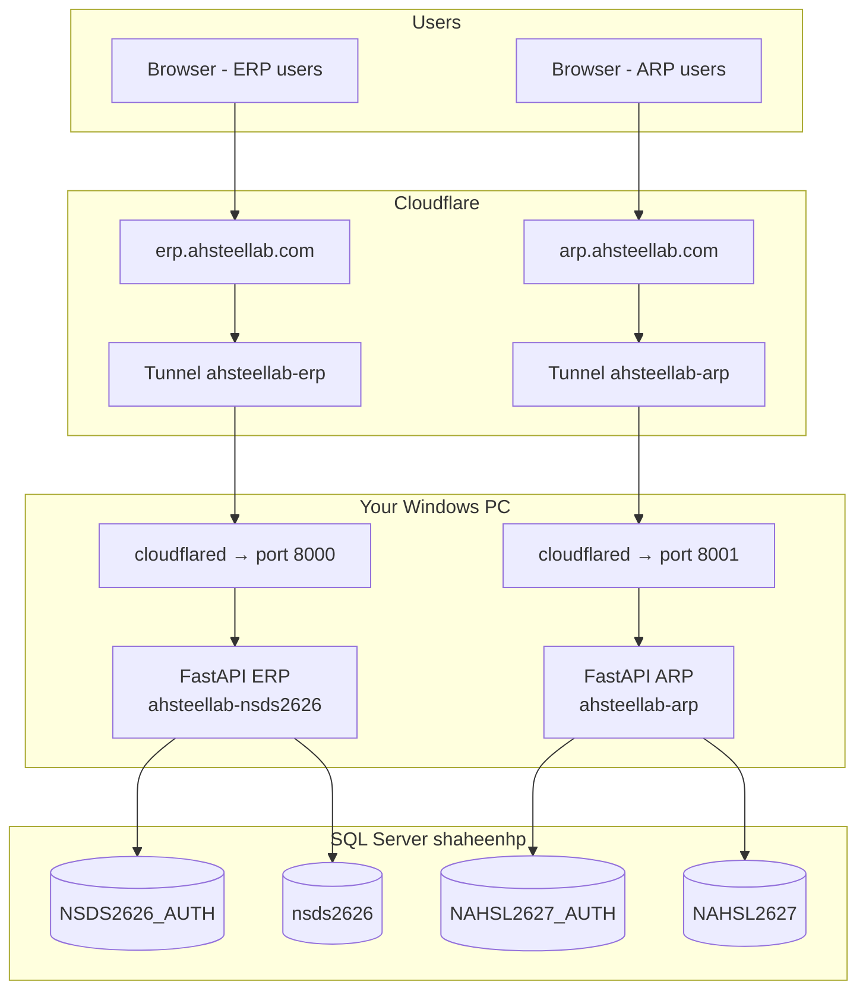
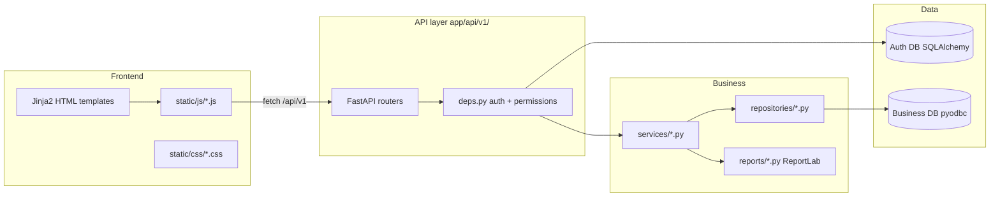
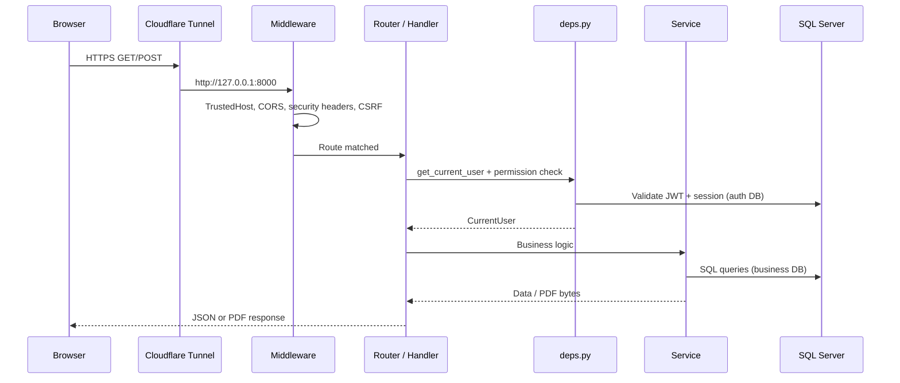
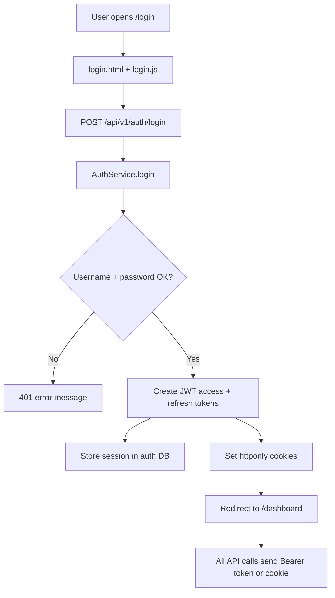
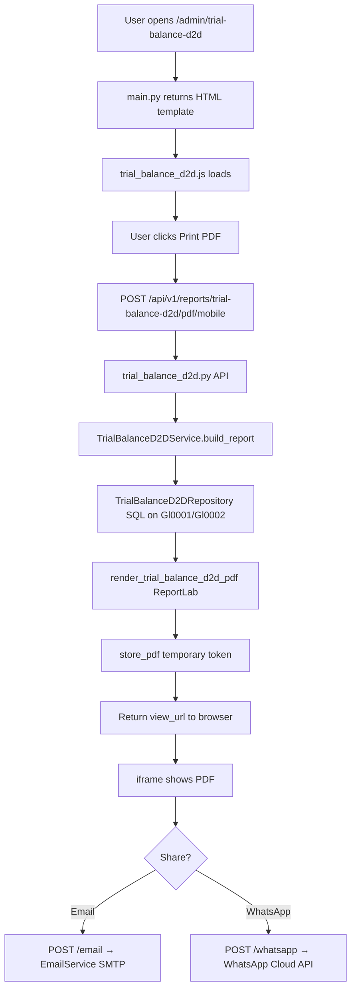
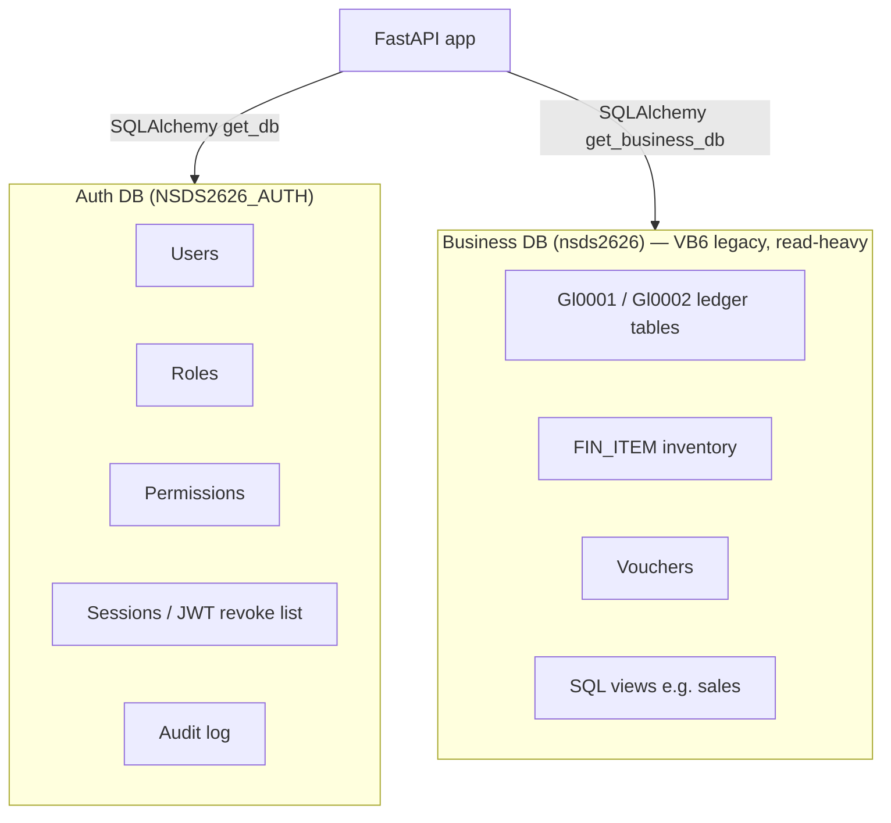
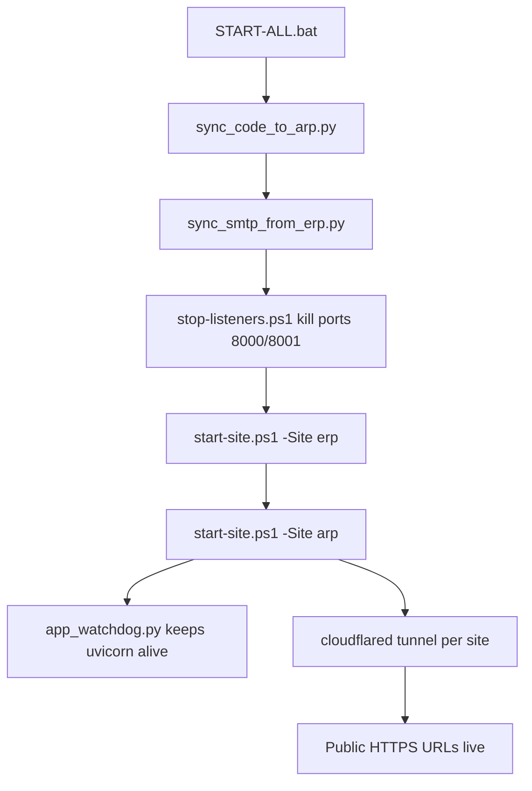

# AH Steel Lab — Architecture Flowcharts & Annotated Code Guide

This document maps how the project works end-to-end.  
**Note:** We do not comment every line in source files (that would clutter production code). Instead, critical paths are explained below with **line-by-line annotations**.

---

## 1. System overview (two sites on one PC)



| Folder | Port | Public URL | Business DB |
|--------|------|------------|-------------|
| `D:\CursorProject\ahsteellab-nsds2626` | 8000 | erp.ahsteellab.com | nsds2626 |
| `D:\CursorProject\ahsteellab-arp` | 8001 | arp.ahsteellab.com | NAHSL2627 |

---

## 2. Application layers (inside each FastAPI project)



**Rule:** Pages in `main.py` only **show HTML**. Data and PDFs come from **API** endpoints.

---

## 3. HTTP request lifecycle



---

## 4. Login flow



---

## 5. Report flow (example: Trial Balance Date to Date)



---

## 6. Annotated code — `app/main.py` (application entry)

Each line explained:

```python
"""FastAPI application entry point."""          # Module docstring: this file starts the web app

from contextlib import asynccontextmanager      # For startup/shutdown hooks (schedulers)
from pathlib import Path                        # Safe file paths on Windows/Linux

from fastapi import FastAPI, Request            # Web framework core types
from fastapi.middleware.cors import CORSMiddleware
from starlette.middleware.trustedhost import TrustedHostMiddleware
from fastapi.responses import HTMLResponse, RedirectResponse
from fastapi.staticfiles import StaticFiles      # Serves /static/css, /static/js
from fastapi.templating import Jinja2Templates   # Renders HTML from app/templates/

from app.api import api_router                   # All /api/v1/* routes bundled here
from app.config.settings import settings         # Reads .env (DB, JWT, SMTP, etc.)
from app.config.site_links import get_external_links, get_internal_link_groups
from app.logging.logger import logger
from app.middleware.security import csrf_middleware, security_headers_middleware
from app.scheduler.sms_email_scheduler import get_scheduler_runner
from app.scheduler.sales_dashboard_email_scheduler import get_sales_dashboard_email_runner

from app.services.email_service import EmailService

BASE_DIR = Path(__file__).resolve().parent.parent  # Project root (folder above app/)
templates = Jinja2Templates(directory=str(BASE_DIR / "app" / "templates"))
templates.env.globals["base_url"] = settings.base_url.rstrip("/")  # Every page knows public URL
templates.env.globals["internal_link_groups"] = get_internal_link_groups()  # Sidebar links
templates.env.globals["external_links"] = get_external_links(settings.base_url)
templates.env.globals["smtp_configured"] = lambda: EmailService().is_configured()
templates.env.globals["smtp_hint"] = lambda: EmailService().configuration_hint()


@asynccontextmanager
async def lifespan(app: FastAPI):
    # Runs ONCE when uvicorn starts the app
    logger.info("Starting %s [%s]", settings.app_name, settings.app_env)
    runner = get_scheduler_runner()                    # Background SMS/email jobs
    sales_email_runner = get_sales_dashboard_email_runner()
    await runner.start()                               # Start async schedulers
    await sales_email_runner.start()
    yield                                              # App is now serving requests
    await sales_email_runner.stop()                    # Runs ONCE on shutdown
    await runner.stop()
    logger.info("Shutting down %s", settings.app_name)


app = FastAPI(
    title=settings.app_name,
    description=f"{settings.app_name} - Enterprise ERP",
    version="1.0.0",
    docs_url="/api/docs",          # Swagger UI for API testing
    redoc_url="/api/redoc",
    openapi_url="/api/openapi.json",
    lifespan=lifespan,
)

# In production, only allow hostnames from .env (erp.ahsteellab.com, etc.)
if settings.is_production and "*" not in settings.allowed_hosts_list:
    app.add_middleware(TrustedHostMiddleware, allowed_hosts=settings.allowed_hosts_list)

app.add_middleware(
    CORSMiddleware,
    allow_origins=settings.cors_origins_list,
    allow_credentials=True,        # Cookies work with fetch()
    allow_methods=["*"],
    allow_headers=["*"],
)

app.middleware("http")(security_headers_middleware)   # X-Frame-Options, etc.
app.middleware("http")(csrf_middleware)               # Protects form POSTs

static_dir = BASE_DIR / "app" / "static"
static_dir.mkdir(parents=True, exist_ok=True)

class NoCacheStaticFiles(StaticFiles):
    async def get_response(self, path, scope):
        response = await super().get_response(path, scope)
        if not settings.is_production:
            response.headers["Cache-Control"] = "no-store, no-cache, must-revalidate"
        return response

app.mount("/static", NoCacheStaticFiles(directory=str(static_dir)), name="static")

app.include_router(api_router, prefix=settings.api_v1_prefix)  # Usually /api/v1


@app.get("/", response_class=HTMLResponse)
async def root(request: Request):
    return RedirectResponse(url="/login")              # Home → login page


@app.get("/login", response_class=HTMLResponse)
async def login_page(request: Request):
    return templates.TemplateResponse(
        request,
        "login.html",                                   # Jinja2 template file
        {
            "app_name": settings.app_name,
            "csrf_token": request.cookies.get(settings.csrf_cookie_name, ""),
        },
    )


@app.get("/dashboard", response_class=HTMLResponse)
async def dashboard_page(request: Request):
    return templates.TemplateResponse(
        request,
        "dashboard.html",
        {
            "app_name": settings.app_name,
            "internal_link_groups": get_internal_link_groups(),
            "external_links": get_external_links(settings.base_url),
        },
    )

# ... more @app.get routes for each admin page (gl-ledger, trial-balance, etc.) ...
# Each route ONLY returns HTML — no database logic here.


@app.get("/health")
async def health_check():
  # Used by START-ALL.bat and Cloudflare to verify app is alive
    return {"status": "healthy", "app": settings.app_name, "env": settings.app_env}
```

---

## 7. Annotated code — authentication (`app/api/deps.py`)

```python
"""FastAPI dependencies for authentication and authorization."""

from typing import List, Optional

from fastapi import Depends, HTTPException, Request, status
from fastapi.security import HTTPAuthorizationCredentials, HTTPBearer
from jose import JWTError
from sqlalchemy.orm import Session

from app.database.session import get_db
from app.repositories.session_repository import SessionRepository
from app.repositories.user_repository import UserRepository
from app.security.jwt import decode_token

security_scheme = HTTPBearer(auto_error=False)  # Optional Bearer header; no error if missing


class CurrentUser:
    """Lightweight user object attached to every protected API call."""
    def __init__(self, user_id: int, username: str, roles: List[str], permissions: List[str], session_id: str):
        self.user_id = user_id
        self.username = username
        self.roles = roles
        self.permissions = permissions       # e.g. "reports.gl_ledger.view"
        self.session_id = session_id

    def has_permission(self, permission: str) -> bool:
        return permission in self.permissions or "auth.admin.full" in self.permissions

    def has_role(self, role: str) -> bool:
        return role in self.roles


async def get_current_user(
    request: Request,
    credentials: Optional[HTTPAuthorizationCredentials] = Depends(security_scheme),
    db: Session = Depends(get_db),           # Opens auth DB session
) -> CurrentUser:
    token = None
    if credentials:
        token = credentials.credentials       # Authorization: Bearer <jwt>
    elif "access_token" in request.cookies:
        token = request.cookies.get("access_token")  # Or from login cookie

    if not token:
        raise HTTPException(status_code=401, detail="Not authenticated.")

    try:
        payload = decode_token(token)         # Verify signature + expiry
    except JWTError:
        raise HTTPException(status_code=401, detail="Invalid or expired token.")

    if payload.get("type") != "access":
        raise HTTPException(status_code=401, detail="Invalid token type.")

    jti = payload.get("jti")                  # Token ID for revocation check
    session_repo = SessionRepository(db)
    if jti and session_repo.is_token_revoked(jti):
        raise HTTPException(status_code=401, detail="Token has been revoked.")

    user_id = int(payload["sub"])             # "sub" = user ID in JWT
    user_repo = UserRepository(db)
    user = user_repo.get_by_id(user_id)
    if not user or not user.IsActive or user.IsDeleted:
        raise HTTPException(status_code=401, detail="User not found or inactive.")

    return CurrentUser(
        user_id=user_id,
        username=payload.get("username", user.Username),
        roles=payload.get("roles", []),
        permissions=payload.get("permissions", []),
        session_id=payload.get("session_id", ""),
    )


def require_permission(permission: str):
    """Factory: use as Depends(require_permission("reports.gl_ledger.view"))"""
    async def _checker(current_user: CurrentUser = Depends(get_current_user)) -> CurrentUser:
        if not current_user.has_permission(permission):
            raise HTTPException(status_code=403, detail="Insufficient permissions.")
        return current_user
    return _checker
```

---

## 8. Annotated code — report API (`trial_balance_d2d.py` core)

```python
router = APIRouter()                            # FastAPI sub-router for this report

_VIEW_PERMS = require_any_permission(         # User needs ONE of these permissions
    "reports.gl_ledger.view",
    "inventory.fin_item.view",
    "auth.admin.full",
)


def _build_pdf(params: TrialBalanceD2DRequest, db: Session) -> tuple[bytes, str, TrialBalanceD2DData]:
    report = TrialBalanceD2DService(db).build_report(params)   # SQL + business math
    pdf_bytes = render_trial_balance_d2d_pdf(report)           # ReportLab PDF
    suffix = "short" if params.short_format else "full"
    filename = f"trial-balance-d2d-{suffix}-{params.date_from}-{params.date_to}.pdf"
    return pdf_bytes, filename, report


@router.get("/accounts/search", response_model=list[GlAccountLookup])
def search_accounts(
    q: str = Query(..., min_length=1),         # Search text from UI
    _user: CurrentUser = Depends(_VIEW_PERMS), # Auth runs BEFORE this function body
    db: Session = Depends(get_business_db),    # Business DB connection (nsds2626)
):
    return GlLedgerReportService(db).search_accounts(q)


@router.post("/pdf/mobile", response_model=GlLedgerMobilePdfResponse)
def create_mobile_pdf_link(
    params: TrialBalanceD2DRequest,            # JSON body: dates, account range, options
    _user: CurrentUser = Depends(_VIEW_PERMS),
    db: Session = Depends(get_business_db),
):
    pdf_bytes, filename, _ = _build_pdf(params, db)
    token = store_pdf(pdf_bytes, filename)      # Short-lived in-memory token
    view_url = f"/api/v1/reports/trial-balance-d2d/pdf/mobile/{token}"
    return GlLedgerMobilePdfResponse(view_url=view_url, filename=filename, expires_minutes=15)


@router.post("/email", response_model=GlLedgerEmailResponse)
def email_pdf(
    params: TrialBalanceD2DEmailRequest,       # Report params + to_email + subject
    current_user: CurrentUser = Depends(_VIEW_PERMS),
    db: Session = Depends(get_business_db),
):
    pdf_bytes, filename, report = _build_pdf(params, db)
    recipients = [p.strip() for p in params.to_email.split(",") if p.strip()]
    subject = params.subject or f"Trial Balance Date to Date ..."
    email_service = EmailService()
    email_service.send_email(recipients, subject, body_text, attachment=(filename, pdf_bytes, "application/pdf"))
    return GlLedgerEmailResponse(message=f"Report emailed to {', '.join(recipients)}.", recipients=recipients)
```

---

## 9. Annotated code — frontend API client (`static/js/api.js`)

```javascript
const Api = {
    getToken() {
        // JWT from localStorage OR cookie set at login
        return localStorage.getItem('access_token') || this.getCookie('access_token');
    },

    getCookie(name) {
        const value = `; ${document.cookie}`;
        const parts = value.split(`; ${name}=`);
        if (parts.length === 2) return parts.pop().split(';').shift();
        return null;
    },

    async request(method, url, body = null, { timeoutMs = 300000 } = {}) {
        const headers = { 'Content-Type': 'application/json' };
        const token = this.getToken();
        if (token) headers['Authorization'] = `Bearer ${token}`;  // Send JWT to API

        const options = { method, headers, credentials: 'include' };  // Include cookies
        if (body) options.body = JSON.stringify(body);

        const controller = new AbortController();
        const timer = setTimeout(() => controller.abort(), timeoutMs);  // 5 min for big PDFs
        options.signal = controller.signal;

        let response;
        try {
            response = await fetch(url, options);   // Browser HTTP call to FastAPI
        } catch (err) {
            if (err?.name === 'AbortError') {
                throw new Error('Request timed out after 5 minutes...');
            }
            throw new Error('Cannot reach server...');
        } finally {
            clearTimeout(timer);
        }
        // ... parses JSON error or returns JSON body ...
    },

    get(url, opts) { return this.request('GET', url, null, opts); },
    post(url, body, opts) { return this.request('POST', url, body, opts); },
};
```

---

## 10. Database split



**Why two databases?** VB6 ERP keeps using `nsds2626` unchanged. Web auth lives separately so login changes never risk production ledger data.

---

## 11. Folder map (what each part does)

| Path | Role |
|------|------|
| `app/main.py` | Starts app, HTML page routes, mounts static files |
| `app/api/v1/*.py` | REST endpoints (JSON, PDF, email) |
| `app/api/deps.py` | JWT auth + permission checks |
| `app/schemas/*.py` | Request/response shapes (Pydantic) |
| `app/services/*.py` | Business rules (VB6-equivalent logic) |
| `app/repositories/*.py` | SQL queries |
| `app/reports/*.py` | PDF layout (ReportLab) |
| `app/templates/` | HTML pages (Jinja2) |
| `app/static/js/` | Browser logic (fetch API, forms) |
| `app/config/settings.py` | All `.env` settings |
| `deploy/` | Cloudflare, start/stop scripts |
| `install/` | First-time setup, `.env` generation |
| `sql/` | Permission seeds, view fixes |
| `scripts/` | Utilities (sync to ARP, SMTP test) |

---

## 12. Start / deploy flow



---

## 13. How to read any feature yourself

1. Find the **URL** in browser (e.g. `/admin/trial-balance-d2d`).
2. Search `main.py` for that path → find **template** name.
3. Open template → see which **`.js`** file it loads.
4. In JS, find `const API = '/api/v1/...'`.
5. Open matching file in `app/api/v1/`.
6. Follow **Service** → **Repository** → SQL.

---

## Related docs

- [TWO-SITES-GUIDE.md](TWO-SITES-GUIDE.md) — ERP + ARP on one PC
- [DISASTER_RECOVERY.md](DISASTER_RECOVERY.md) — Restore from backup
- [GITHUB_BACKUP.md](GITHUB_BACKUP.md) — Push to GitHub
- [CLOUDFLARE_DEPLOY.md](CLOUDFLARE_DEPLOY.md) — Tunnel setup
