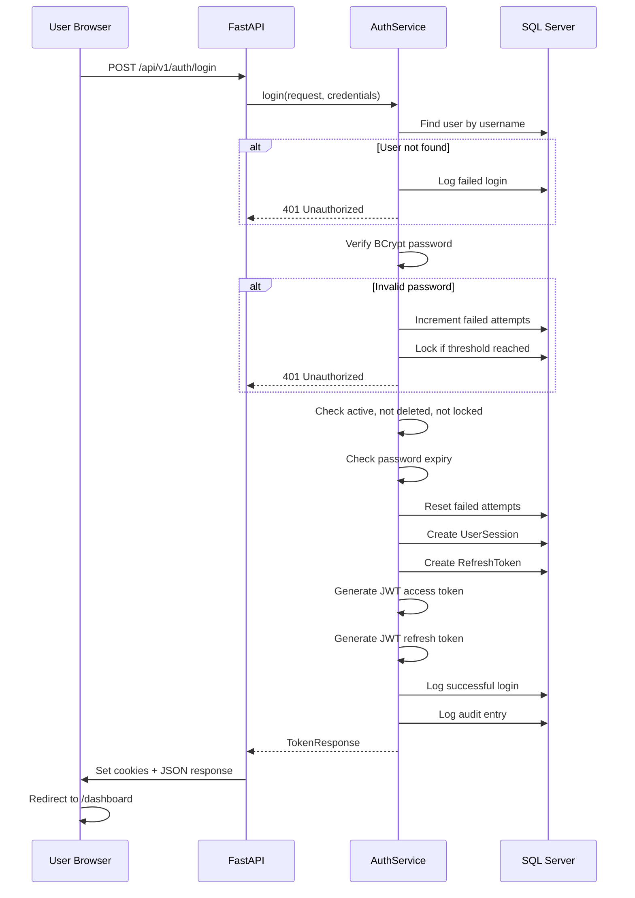

# Authentication Flow

## Login Sequence



## Token Refresh

```
Client sends refresh_token
  → Decode JWT
  → Check JTI not in RevokedTokens
  → Verify token hash in RefreshTokens table
  → Verify session not revoked
  → Issue new access token
  → Update session last activity
```

## Logout

```
Client sends access_token + refresh_token
  → Revoke access JTI in RevokedTokens
  → Revoke refresh token in RefreshTokens
  → Mark session as revoked
  → Clear cookies
  → Log audit entry
```

## Password Change

```
Authenticated user sends current + new password
  → Verify current password
  → Validate new password policy
  → Check password history (last 5)
  → Store old hash in PasswordHistory
  → Update PasswordHash
  → Set PasswordExpiryDate (+90 days)
  → Clear MustChangePassword flag
  → Log audit entry
```

## First Login Password Change

When `MustChangePassword = true`:
1. Login succeeds but response includes `must_change_password: true`
2. Frontend shows warning
3. User must call `/api/v1/auth/change-password` before accessing protected resources

## Concurrent Sessions

- Maximum 5 active sessions per user (configurable)
- Oldest session revoked when limit exceeded
- Admin can force-revoke via `/api/v1/sessions`

## Remember Me

- Standard refresh: 7 days
- Remember Me: 30 days
- Session cookie max-age adjusted accordingly
